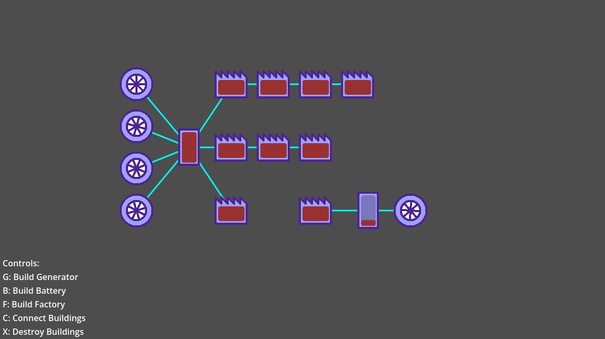

# Power System Sample

A Godot implementation of an electrical power network for implementation in games.

This implementation separates concerns of generation, storage, and consumption into components that can be attached to buildings to enable functionality.

A detail of this implementation is that buildings that consume power must also store it so they can be consumed by the building's logic, which means that they behave similarly to storage buildings, except that energy stored within is never re-distributed back to the network, behaving as if they had a one-way valve.



### Power Cycle

A single cycle of power generation and distribution is separated into a few steps:

```gdscript
# Generate all power across all generators
var available := generate_power(delta)

# Fetch stored power from all power storages; this step exhausts power storages
available += consume_stored_power()

# Equally distribute power across all consumers that are available in a network
var remaining := distribute_power_to_consumers(available)

# Re-store any remaining power to power storages; this step re-fills power storages
store_power(remaining)
```

The step of distributing power to consumers and power storages is similar and uses the following algorithm:

```gdscript
# Make passes, attempting to distribute power until we either run out of
# power to distribute, or available distributable sources.
while power > 0.0:
    # Fetch enabled, non-full power consumers
    var available_consumers := get_available_power_consumers()
    if available_consumers.is_empty():
        break

    var per_building := power / available_consumers.size()

    var has_consumed := false

    for consumer in available_consumers:
        var component := consumer.find_component(BuildingComponent.Kind.POWER_CONSUMER) as PowerConsumerComponent

        var stored := component.store(per_building)
        if stored > 0.0:
            power -= stored
            has_consumed = true

    if not has_consumed:
        break

# Returns any remaining power at the end to e.g. distribute to storages
return power
```

This system has a few characteristics due to its implementation:

1. Power is distributed equally across all consumers, filling up consumers with less storage before consumers with more storage;
2. Power in power storage buildings, e.g. batteries, are equally distributed to all consumers and other storages instantaneously as soon as they are connected.

This implementation uses an internal graph object to track connectivity of buildings and build connected networks that have their power interconnected, although the basic logic of the power cycles could also be reused with other connection mechanics, such as  generators providing power to physically nearby consumers.

### Performance Notes

The code for generating networks although exact is not entirely performatic, and may result in slow downs when changes to very large building graphs are made. These changes occur whenever a new building is added, a building is connected to another, or a building is destroyed.
